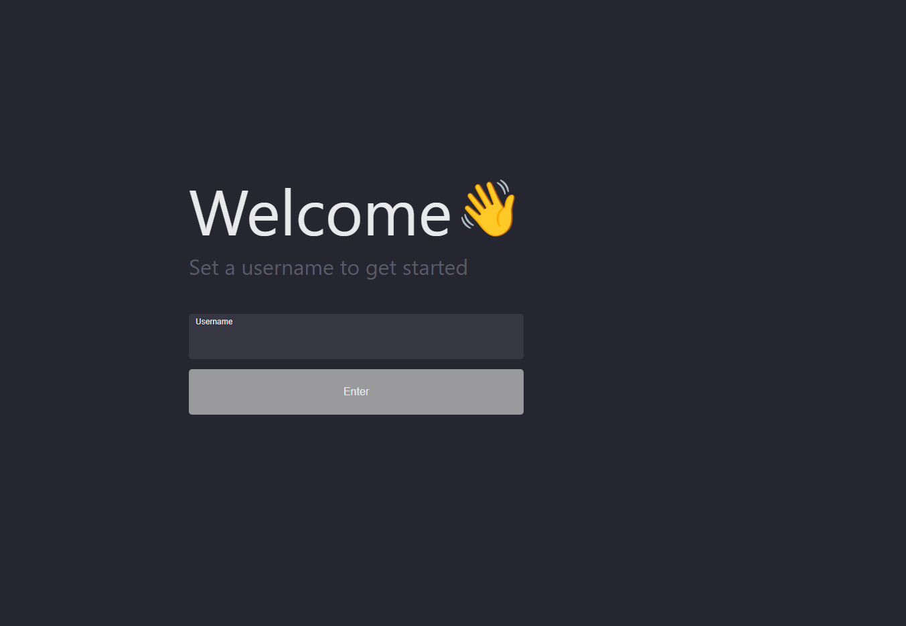
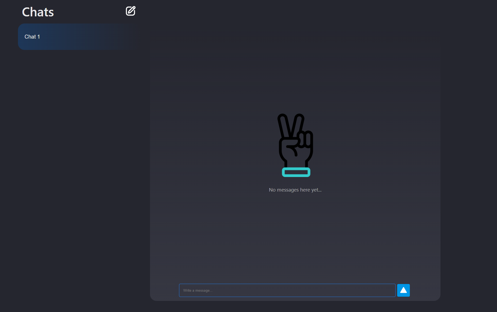
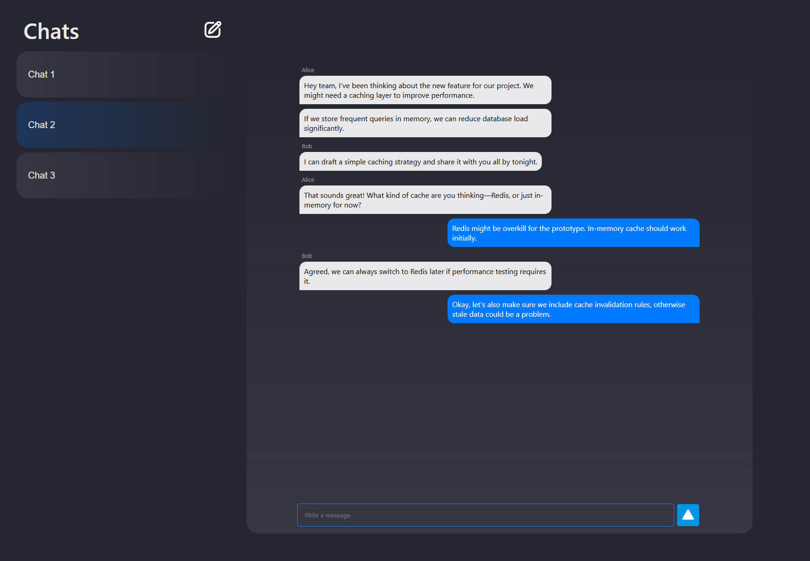

# Realtime Chat App

A real-time chat application built with.

## Features

- Multiple users can chat in real-time.  
- Independent chat rooms.  
- Create new chat rooms dynamically.  
- Messages show the user's display name.  

---

## Getting Started

### Architecture

- Frontend (React) connects to backend via WebSockets for real-time messaging.
- Backend (Python) manages chat rooms and broadcasts messages to connected users.

### Frontend

```bash
# Navigate to frontend
cd chat-frontend

# Install dependencies
npm install

# Start frontend development server
npm start
```
The frontend will typically run on http://localhost:3000.


### Backend
```bash
# Navigate to backend
cd chat-backend

# Install dependencies
pip install -r requirements.txt

# Start the FastAPI server
uvicorn main:app --reload --host 127.0.0.1 --port 8000
or 
uvicorn main:app --host 0.0.0.0 --port 8000
```

Using --host 0.0.0.0 allows any device on your network to connect using your machine's IP.

## Preview | How It Works | Usage Guide

### 1. Log In
- Open the app at [http://localhost:3000](http://localhost:3000). 
> Alternatively, if the backend is running with `--host 0.0.0.0`, you can open the app on any device on your local network (like your mobile phone) using your computer's IP address as the host.
- Enter a **unique display name** to identify yourself in chat rooms.  
- Click **“Enter”** to enter the main chat interface.  



---

### 2. Create a Chat Room
- Click the **“+”** button in the chat room list.  
- Your new room will appear in the list of chat rooms.  



---

### 3. Join a Chat Room
- Click on any chat room in the list to join.  
- Once inside, you will see all messages in that room.  
- Messages from other users will appear in real-time if chat room exists.  



---